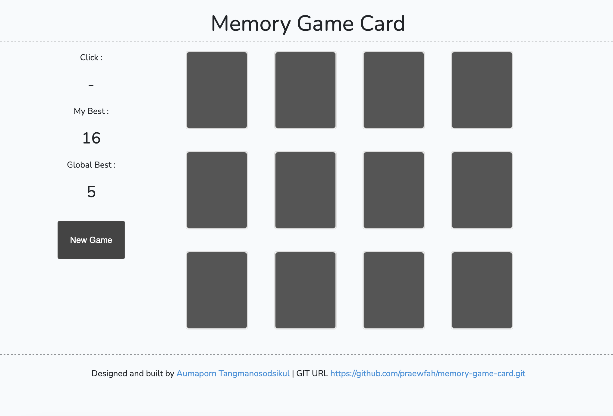

## Handle http requests in a Laravel Vue.js app with Axios.

A Laravel Vue.js project using axios to handle http requests and Vuex to manage state. 

[Live Demo](https://memory-game-card.herokuapp.com)

## Getting Started
Make sure you have `npm` and `composer` on your local machine

1.  Clone this repository and cd into it
2.  Run `composer install` and `npm install` to download laravel dependencies
3.  Run `php artisan key:generate` to generate a key for the app
5.  Set up your database in your `.env` file and run php `php artisan migrate`
6.  Execute `composer dump-autoload` or `php composer.phar dump-autoload`
7.  Execute `npm run dev` to build project assets
8.  Execute `php artisan serve` to run the project in your browser

## Unit Test
- phpunit

### Prerequisites

* Laravel
* Vue
* Vuex
* npm

## Built With

* [Laravel](https://laravel.com/) - Beautiful Php framework
* [Vue](https://vuejs.org/) - A Great reactive Js framework
* [Vuex](https://vuejs.org/) - Vuejs state management made simple
* [Bootstrap](https://getbootstrap.com) - A beautiful css framework
* [Axios](https://vuejs.org/) - A Js library to handle ajax requests easily

## Document

[Install Document](https://memory-game-card.herokuapp.com/install-project.pdf)
[API Document](https://memory-game-card.herokuapp.com/api.pdf)